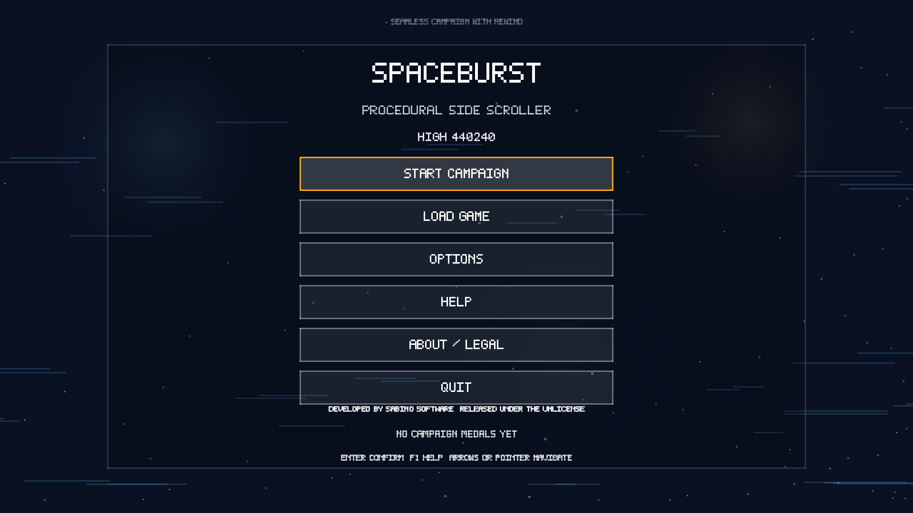
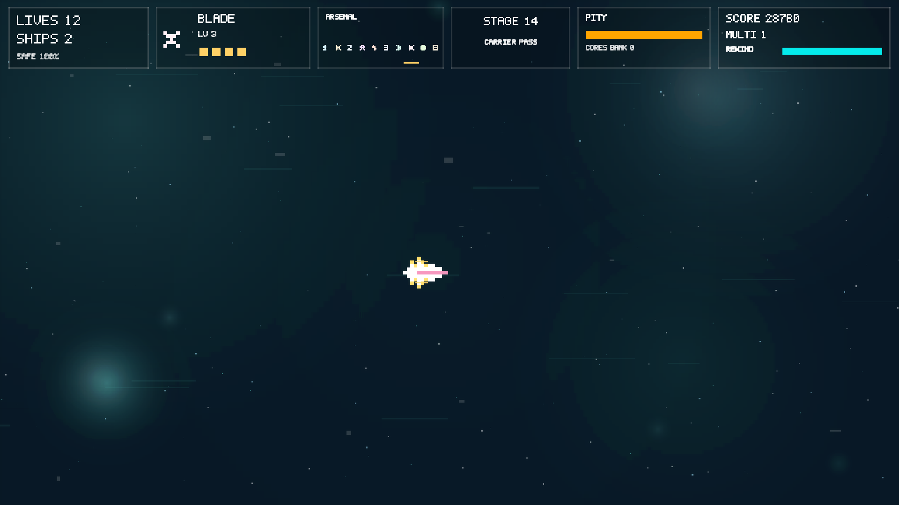
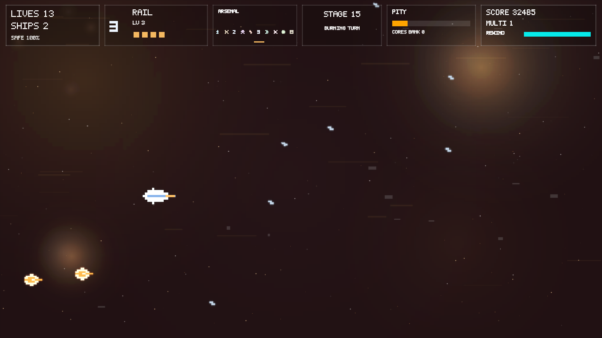

# SpaceBurst

SpaceBurst is a procedural side-scrolling shooter built around deterministic rewind, authored campaign progression, style-specific weapon drafts, procedural visuals, and runtime-generated audio. The project targets Windows, Linux, and Android from a single repository.

Developed by **Sabino Software**
License: **The Unlicense**







## Features

- 50-stage campaign with boss fights on stages 10, 20, 30, 40, and 50.
- Deterministic rewind, save slots, and transition-time upgrade drafts.
- Ten weapon styles with style-specific power cores and progression.
- Procedural art, feedback effects, chapter-aware music, and runtime-generated audio.
- Desktop, Linux, and Android packaging paths.
- GitHub Actions for PR checks, prereleases, and Pages docs.

## Controls

### Desktop

- `W A S D`: move
- `Arrow Keys`: aim
- `Space`: fire
- `Q / E`: switch owned weapon styles
- `R`: rewind
- `Esc`: pause
- `F1`: help

### Android

- Left touch pad: move
- Right touch pad: aim and fire
- `R` touch button: rewind

## Saves, Rewind, and Progression

- Three local save slots are available from the pause flow and title screen.
- Rewind stores up to 8 seconds of deterministic gameplay state.
- `Ships` give in-place respawns.
- `Lives` restart the current stage once ships are exhausted.
- Power cores feed between-stage upgrade drafts and long-run weapon growth.

## Release Downloads

- Releases: [github.com/sabino/SpaceBurst/releases](https://github.com/sabino/SpaceBurst/releases)
- Documentation: [sabino.pro/SpaceBurst](http://sabino.pro/SpaceBurst/)

## Local Build

Prerequisite: install the .NET 8 SDK.

```powershell
dotnet restore
dotnet build SpaceBurst.sln
dotnet test SpaceBurst.Runtime.Tests/SpaceBurst.Runtime.Tests.csproj
.\build-all.ps1
```

The local aggregate build writes deterministic outputs to:

- `artifacts/release/latest/game-win-x64/SpaceBurst.exe`
- `artifacts/release/latest/leveltool-win-x64/SpaceBurst.LevelTool.exe`
- `artifacts/release/latest/android-apk/com.sabino.spaceburst-Signed.apk`

## Android Build

```powershell
.\build-android.ps1 -InstallDependencies
```

If a USB-debug-enabled device is connected:

```powershell
.\build-android.ps1 -InstallOnDevice
```

## Documentation

Build the local docs site with:

```powershell
.\build-docs.ps1
```

The output site is written to `docs/_site`.

## GitHub Automation

The repository now includes:

- PR checks for Windows build/tests, Linux publish smoke, Android smoke build, and DocFX smoke.
- Master prereleases with Windows, Linux, and Android game artifacts.
- GitHub Pages documentation published from DocFX.

## Public Credit and License

SpaceBurst is developed by **Sabino Software** and released under **The Unlicense**. The full license text is available in [`LICENSE`](LICENSE), in the packaged desktop builds, and in the in-game About/Legal screens.
