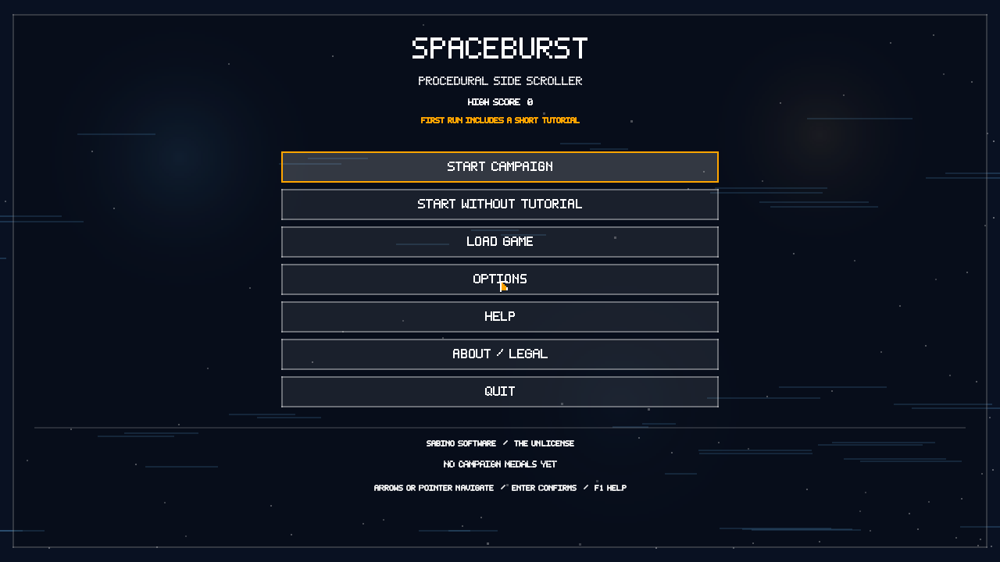
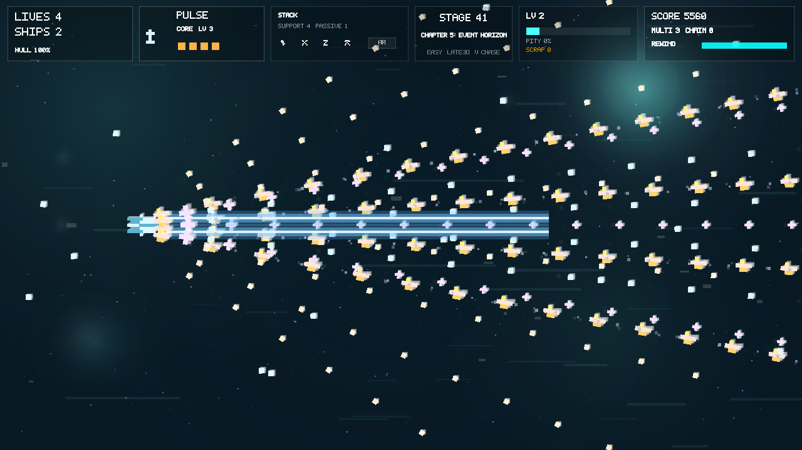
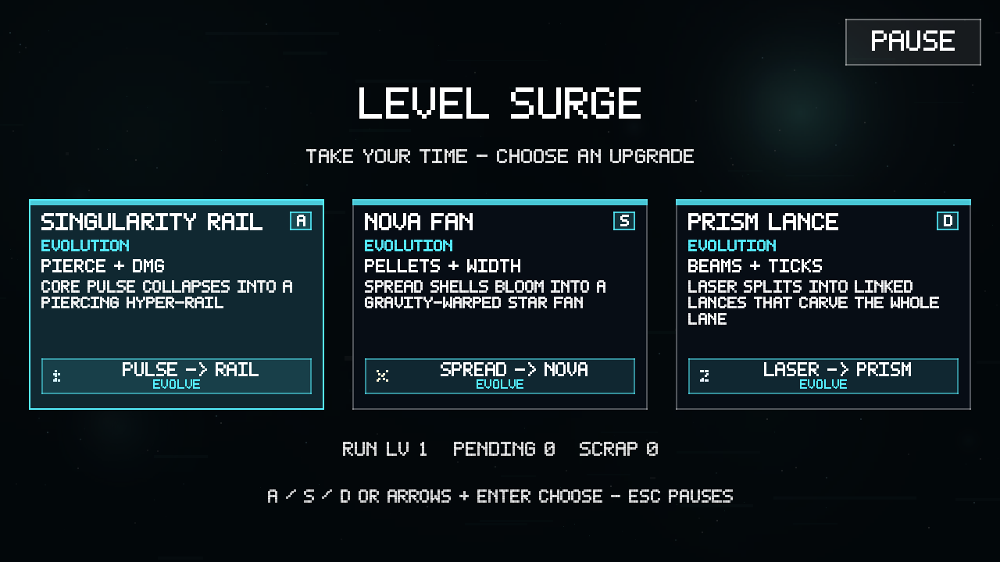
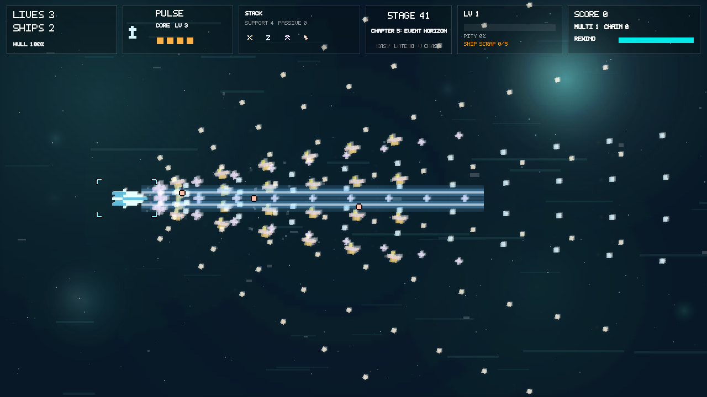

# Playability audit and improvement plan

Audit date: 2026-10-06. Baseline: `1a7d3607e20f5a0cc2f4a1f1197d17c6e48bbc6d`.

## Verdict

SpaceBurst is a playable shooter foundation with a substantial campaign, a complete menu-to-run loop in code, authored encounters, five boss milestones, ten weapon styles, saves, rewind, and generated presentation/audio. It is **not yet established as a feature-complete, balanced, readable release**. Baseline green CI missed reproducible failures in the actual game host. The baseline also had unused progression rewards and dense weapon stacks that impaired readability; implementation progress below tracks the repairs.

“Fun” needs player evidence: tests establish correctness and reachability, not enjoyment. The release gate should include fresh-player observation and representative full runs, with attention to perceived fairness, understandable decisions, and distinct weapon roles.

## Evidence and limits

- Built and ran DesktopGL on Linux with .NET 8.0.404, a virtual X display, software graphics, and a null audio device.
- Baseline suites: **46 game tests + 16 runtime tests passed**. All 50 level definitions validate; boss definitions occur every tenth stage. Recent master release and browser deployment workflows succeeded.
- Ran actual game-host checks: rewind medal eligibility, empty meter load, per-stage death tracking, reserve persistence, and manual draft waiting **all failed on baseline**.
- Captured live title and simulation scenes at stages 1, 10, 21, and 41. Later samples use an artificially upgraded stack and invulnerability to inspect presentation; these are not evidence of ordinary-player difficulty or completion.
- Reviewed flow, input, spawning, damage masks, saves, procedural sprite ownership, weapons/evolutions, progression, host packaging, and CI. This is an initial systems audit, not a claim that every code path has been exercised.
- Android device play, browser input/audio, subjective audio mix, 3D combat, controller ergonomics, and unassisted 50-stage completion still require dedicated validation. Null audio cannot substantiate sound quality.

## Confirmed issues

| ID | Priority | Finding and evidence | Required result |
| --- | --- | --- | --- |
| C01 | P0 | `UpdateRewind` marks medals ineligible, then restores an earlier eligible `PlayerStatus` snapshot. Reproduced in the host. | Rewind permanently disqualifies the run. |
| C02 | P0 | `RestoreRunSaveData` restores RNG before reconstructing enemies; `Enemy` constructors sample that stream. | Restored RNG and subsequent random outcomes match the captured run, with live enemies and bosses. |
| C03 | P1 | Loading a zero rewind meter replaces it with full capacity. Reproduced. | Preserve zero and partially spent meters. |
| C04 | P1 | `StartStageFromTransition` does not reset `stageHadDeath`. One death blocks no-death medals on later stages. Reproduced. | Reset stage history, retain campaign history. |
| C05 | P1 | `ApplyStageDefaults` overwrites Armor Plating and emergency reserve upgrades. Reproduced across stage changes. | Reserve improvements survive progression, retries, and save/load. |
| C06 | P1 | Holding rewind returns before simulation updates even with insufficient frames or energy. | Unavailable rewind must allow normal simulation. |
| C07 | P1 | Manual drafts auto-select after 4 seconds (5 in tutorial); Escape also purchases a card. Reproduced timeout. | Let players read and explicitly choose. Timeouts should apply only to an enabled auto mode. |
| C08 | P1 | Draft descriptions draw a long single line into 300px cards. Evolution descriptions can exceed the card. | Wrap and fit every offered card, including large UI scales and narrow windows. |
| C09 | P1 | Every bullet/enemy and rebuilt hull allocates a `Texture2D`; expired entities, resets, and replacement sprites have no explicit disposal. Rewind repeatedly rebuilds all entities. | Deterministic resource ownership and cleanup; sustained play/rewind must not accumulate GPU resources. |
| C10 | P1 | `ScrapCache` drafts say “FOR FUTURE SHIP FRAMES”, but scrap only increments a counter and appears in HUD/summary. No purchase/spend path exists. | Give salvage an implemented, explained effect or remove the misleading draft reward. |
| C11 | P2 | Weapon cores collected outside the tutorial accumulate style charges; the only `TryConsumeUpgradeCharge` path is the tutorial draft. | Give legacy/core pickups a useful normal-run path and align documentation. |
| C12 | P1 | Dense stacks overlap the player with beams and many large bright friendly projectiles. Live upgraded stage-41 render demonstrates weak player salience. | Clear player silhouette and threat hierarchy under maximum stacks. |
| C13 | P2 | UI terminology mixes cores/charges, run XP, levels/ranks, scrap, hull, ships/lives, pity, and chain. README promises transition-time charge drafts, while normal drafts open immediately on XP level-up. | Match help/README to current mechanics; explain each resource where it matters. |
| C14 | P2 | CI covers publishing and small tests, without game-host assertions for saves/rewind/progression. | Run real graphics-backed regressions and campaign liveness checks. |
| C15 | P1 | Legal upgrade sequences reduce movement 1.8→1.4, rewind efficiency 0.65→0.60, drop chance 0.28→0.24, and reserves 7→6 because paths use inconsistent caps. Reproduced with production progress methods. | Upgrades never reduce an existing stat, regardless of order. |
| C16 | P1 | Tutorial rewind restores an earlier tutorial step as well as the world. A prompt-following keyboard run alternated FIRE/REWIND and failed to finish within 180 simulated seconds. | Preserve the rewind instruction until fulfilled; finish the tutorial with any of its three draft choices. |
| C17 | P1 | Boss presentation scale is 1.45–3.80 while point/overlap checks and damage mapping still use the original render scale. Host pixel sampling found 52%–93% of visible boss hull pixels outside the physical mask. | Use one consistent sprite scale for rendering, collision bounds, overlap tests, and damage coordinates; cover all five bosses. |

## Balance and release questions requiring measurements

These are design risks, not reproduced balance bugs:

- First chapter has **718.9 authored seconds**, versus **432.6–471.35** in each later chapter. Total authored timeline is **2536.3 seconds (42.3 minutes)** before boss fights, transitions, drafts, and enemy cleanup. Test whether the first chapter delays novelty too long.
- Score awards extra lives every 3000 points indefinitely. Multipliers rise to 20, bosses award five times their archetype score, and ships refill per stage. Measure lives gained/lost and effective survival pressure before changing numerical difficulty.
- Three permanent passive slots choose among six reactors. That can exclude multiple evolutions for the rest of a run. Show prerequisites before committing and decide whether replacement is an intended mechanic.
- Hordes use different scheduling/spacing and pressure rules than section waves. `CountPerBurst` can overshoot the hostile cap because it checks only before a whole burst; mobile permits 30 hostiles versus desktop 52. Measure peak enemy/bullet counts and reaction windows by platform.
- Validate enemy attack tells, contact vs projectile damage, pickup recognition, and high-stack readability with bloom on/off. Difficulty monotonicity is not sufficient evidence of fair difficulty.
- Validate browser blur/tab return with held inputs, gesture-gated audio, localStorage failure, viewport resize, and gamepad disconnect/reconnect; validate equivalent Android lifecycle/back behavior on-device.
- Enemy spatial index is rebuilt after entity updates, while beams query it during updates. Assess one-frame targeting lag against fast enemies before treating it as a demonstrated hit bug.

## Sequential implementation plan

1. **Campaign correctness:** C01–C06, graphics-backed regression host, CI integration. Acceptance: exact saved RNG, durable medal disqualification, correct meters and reserve/death state.
2. **Readable upgrade decisions:** C07–C08. Acceptance: manual mode never spends on timeout/Escape; all draft copy fits; auto mode remains opt-in.
3. **Procedural resource lifecycle:** C09. Acceptance: expired entities, reset, rewind restoration, loadout replacement, and shutdown explicitly release owned textures without disposing the persistent player during resets.
4. **Honest, useful rewards:** C10–C11 and docs in C13. Prefer a small implemented salvage effect over promising unavailable ship frames; make unused weapon cores useful without bypassing chapter gates.
5. **Combat readability:** C12. Tune friendly projectile size/opacity, beam layers, trail/debris budgets, player outline/hitbox cue, and HUD priorities. Verify sparse and dense combat in 2D and 3D at 720p, resized desktop, and touch layouts.
6. **Campaign liveness and balance instrumentation:** Record stage time, deaths, lives awarded, drafts, weapon usage, damage, peak entities, frame time, and rewind allocations across fixed seeds. Exercise all bosses and completion with controlled simulation; separately run normal input-based playthroughs. Tune pacing and rewards from those results.
7. **Release acceptance:** Windows/Linux/browser/Android matrix for start/tutorial/skip, pause/help/options, save/load, death/retry, transitions, five bosses, completion, reload, resize, focus and controller/touch. Fresh players must identify the player/threats/rewards and explain draft choices; collect enjoyment and fairness feedback before claiming “fun and feature complete”.

Each implementation lands through a focused PR, local verification, all PR CI jobs, and merge only after passing checks. Track remaining acceptance work rather than closing the audit after build success.

## Implementation progress

- PR #20 merged after all five CI jobs passed: C01–C06 are fixed, with nine graphics-backed assertions in CI and a reserve save/transition unit regression.
- Draft review also found mismatched draw/click bounds (drawn at y=198 with height 246; interactive at y=214 with height 220), and paused saves did not preserve the logical tutorial/draft return state. These are covered with the readable-draft work.
- A locally published browser bundle boots after a sustained user gesture, enters the tutorial, fires, and resizes to 960×540 without reported JavaScript errors. This is a smoke check, not a completed browser campaign or audible audio review.

- PR #21 merged after all CI jobs passed: deliberate manual drafts, wrapped/fitted text, shared draw/click bounds, pointer/touch pause, and logical draft/tutorial state through sealed save/load. All ten evolution descriptions were checked at 70%, 100%, 150%, and 220% text scaling.
- Controlled Normal campaign liveness run reached stages 1–50, all five bosses, and the ending in **2610.6 simulated seconds**, with 17 draft choices and 186 lives remaining. The runner used invulnerability and scripted high-damage hits. This validates structural completion and illustrates unbounded life generation; it does not validate human difficulty. Android/browser full runs and skill-based runs remain release gates.
- Resource review also found unbounded managed mesh/voxel caches keyed by damaged hull shape. The resource task bounds those caches and shares immutable projectile sprites to reduce per-shot/rewind GPU allocation.

- PR #22 merged after all five CI jobs passed: entity/player/cache GPU ownership, bounded mesh caches, shared projectile sprites, 100 repeated restores, and a 1,000-shot allocation check. The graphics-backed full campaign liveness check now runs in Linux CI.

- PR #23 merged after all five CI jobs passed: salvage grants a spare ship every five scrap, campaign spare cores grant XP, legacy charges convert once, and reward help/docs match behavior. The five-scrap threshold still needs player balance evidence. Help pages outside the draft also need a full accessibility-scale/layout pass.

- Readability pass renders friendly fire below ships and hostile shots above them, reduces friendly shot/beam brightness and trail emissions, and avoids friendly projectile depth writes in 3D. Side view has a stable post-bloom player locator and crisp hostile-shot contours. Controlled scenes at stages 1, 21, and 41 were reviewed with Low and Neon presets, including 3D. Collision geometry and projectile scale are unchanged. These samples are presentation checks, not proof of fair human dodging or device performance.

- PR #24 merged after all five CI jobs passed: quieter/layered friendly fire, stable side-view player locator, and crisp hostile-shot contours. Human readability and 3D/device acceptance remain open.
- Tutorial follow-up found C16. Guided rewind now preserves its lesson while restoring the world and is available during that lesson only, so later practice choices cannot be undone. The CI host follows movement/aim/fire/rewind/collect/style/confirm prompts and chooses each of the three cards through keyboard input.

- PR #25 merged after all five CI jobs passed: guided tutorial rewind no longer restores an earlier lesson. All three prompt-following keyboard paths now complete into stage 1; continued R holds during collection are covered.
- C15 upgrade paths now retain stronger existing values rather than lowering them to a different path's cap. Initial survival safeguard caps lives and spare ships at nine, advances consumed score thresholds at full stock, safely saturates scores, normalizes legacy surplus stock after integrity verification, and omits salvage drafts at full ship stock. Human testing must still tune the cap and life-award cadence.

Controlled fixed-seed campaign runs (invulnerable, scripted hits; **not human balance evidence**):

| Difficulty | Simulated seconds | Drafts | Lives before cap | Lives after cap |
| --- | ---: | ---: | ---: | ---: |
| Easy | 2610.3 | 16 | 184 | 9 |
| Normal | 2610.6 | 17 | 186 | 9 |
| Hard | 2609.2 | 17 | 188 | 9 |
| Insane | 2609.0 | 16 | 184 | 9 |
| Realistic | 2600.6 | 16 | 181 | 9 |

All runs visited stages 1–50, fought bosses 10/20/30/40/50, and reached the ending. The CI host now exercises all five difficulties. Additional death/retry/game-over and score/stock overflow checks pass. C17 was discovered during this follow-up and is the next geometry task.
