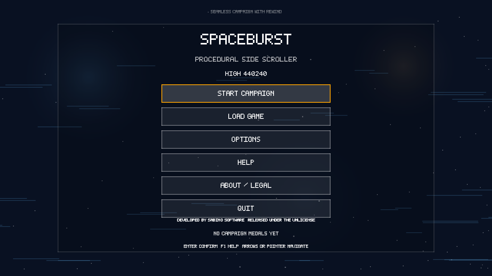

# SpaceBurst

SpaceBurst is a procedural side-scrolling shooter with deterministic rewind, weapon draft transitions, chapter-based music, cross-platform packaging, and a 50-stage campaign that targets Windows, Linux, Android, and modern browsers.

## Highlights

- Five progressively paced chapters across 50 authored stages, with a boss every 10th stage.
- Ten weapon styles, four simultaneous support slots, and one unique evolution per style.
- Horde, elite, kill-chain, and presentation systems across the entire campaign.
- Fully procedural gameplay visuals, effects, and runtime-generated audio.
- Deterministic rewind, save slots, stage transitions, and upgrade drafts.
- Desktop, Linux, and Android release packaging from GitHub Actions.
- Public docs generated from code comments plus contributor guides.

## Start Here

- [Gameplay and progression](articles/gameplay.md)
- [Controls by platform](articles/controls.md)
- [Save slots, rewind, and progression state](articles/save-rewind.md)
- [Build and release workflow](articles/build-release.md)
- [Project architecture](articles/architecture.md)
- [License and credits](articles/license-credits.md)
- [Play in browser](http://sabino.pro/SpaceBurst/web/)

## Downloads

- Releases: [github.com/sabino/SpaceBurst/releases](https://github.com/sabino/SpaceBurst/releases)
- Source: [github.com/sabino/SpaceBurst](https://github.com/sabino/SpaceBurst)
- Browser build: [sabino.pro/SpaceBurst/web](http://sabino.pro/SpaceBurst/web/)

## Public Product Identity

- Developed by **Sabino Software**
- License: **The Unlicense**
